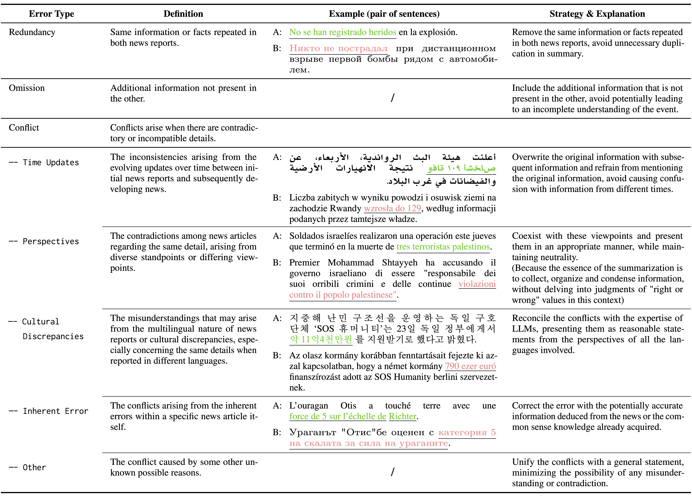
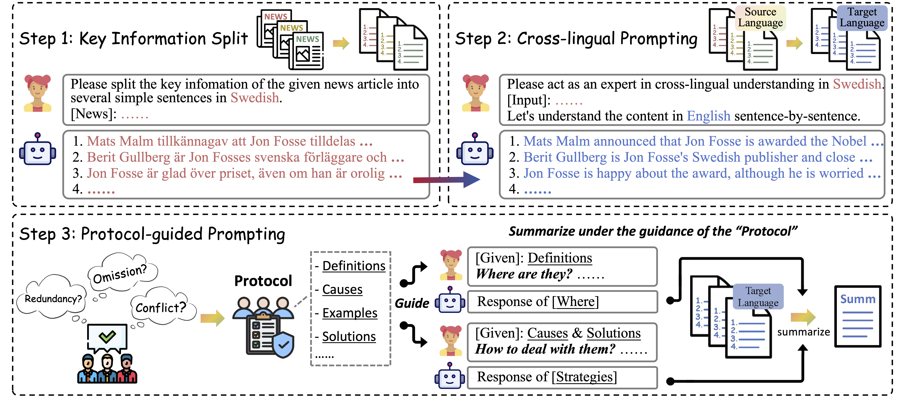

# GlobeSumm

 GlobeSumm: A Challenging Benchmark Towards Unifying Multi-lingual, Cross-lingual and Multi-document News Summarization (EMNLP 2024)


## Why we constructed "GlobeSumm"?

<p align="center">
  
</p>

Events involved with armed conflicts, international relations, and political elections have always fascinated people worldwide. However, relying solely on news articles in a single language to gain an in-depth understanding of such events can be limiting. This is because news reports from different countries are often influenced by their national standpoints and cultural biases, resulting in potential distortions. To obtain a more comprehensive insight into these events, it is crucial to explore news articles from various countries and languages, allowing us to consider diverse perspectives and access more objective information. To this end, we constructed **GlobeSumm**.


## What can you do with "GlobeSumm" / get from "GlobeSumm"?

Though "GlobeSumm" is a multilingual news summarization dataset, many of the intermediate processes involved in constructing it can also be applied to various other tasks.

### 1. **Event-centric multilingual news reports**

(download link) [Event-centric Multilingual News Reports ](https://www.alipan.com/s/LqXfhEvAUng)

- A total of 370 news events, consisting of 4687 news articles, have been finally retained in GlobeSumm.
- The entire dataset spans 26 languages.
- Each news event is associated with a minimum of 10 news reports in different languages.

<!-- ## [Event-centric Multilingual News Reports ](https://www.alipan.com/s/LqXfhEvAUng) -->

```python
# data structure

{ # Event1
  "date": 20230501,
  "description": "a Cessna 206 light aircraft with seven people on board crashed in the jungle in the Caquetá Department of Colombia.",
  "category": "Disasters and accidents",
  "news": [
    { # news1
      "lang_abbr": "fr", "lang_full": "French", "date": "20230517",
      "title": "XXX",
      "article": "XXX",
    },
    # news2
    # news3
    ...
  ]
},
# Event2
# Event3
...
```


### 2. **News relevance determination data**

(download link) [Relevance Determination ](https://www.alipan.com/s/r63AQgZ9r3m)

- In the process of transforming unstructured news into event-centric form, we employ an event retrieval method to gather a collection of news articles related to the given news description.
- The retrieved news articles in different languages are expected to be highly relevant to the provided description, but high relevance does not necessarily mean they all describe the same news event.
- Therefore, we include a post-retrieval manual verification process.
- These manually annotated data, which involves 2104 events with 26301 news articles, are also available. 

<!-- ## [Relevance Determination ](https://www.alipan.com/s/r63AQgZ9r3m)  -->

```python
# data structure
# For each news report, except that there is one more key "label_relevant".
# "label_relevant" equals 1 if the news report is relevant to the given "description", 0 otherwise.

{ # event1
  "date": 20230501,
  "description": "a Cessna 206 light aircraft with seven people on board crashed in the jungle in the Caquetá Department of Colombia.",
  "category": "Disasters and accidents",
  "news": [
    { # news1
      "lang_abbr": "fr", "lang_full": "French", "date": "20230517",
      "title": "XXX",
      "article": "XXX",
      "label_relevant": 1
    },
    # news2
    # news3
    ...
  ]
}
# Event2
# Event3
...
```


### 3. Global News Summarization

(download link) [GlobeSumm ](https://www.alipan.com/s/XRFPqBvNjNk)

- Chronological Recurrent Summarization (CRS)

  - Our summary annotation approach is conducted under the CRS schema, aiming to distill key information from news articles in chronological order. Specifically, we begin by organizing these news documents in order of their respective timestamps. Then the summarization process is initiated by generating a concise summary for the first two articles. The obtained summary is then integrated with the subsequent article, and iteratively throughout the whole document set.

<p align="center">
  
</p>

- 3.1 Key Information Split (KIS)

  - Reduce the length of input by organizing key information from each document into several finely-grained sentences before summarizing the whole document set.

- 3.2 Cross-lingual Prompting (CLP)

  - To effectively capture the alignment from

    various input languages to target language, we employ cross-lingual alignment prompting method, which was first introduced in [Qin et al. (2023)](https://arxiv.org/pdf/2310.14799).

- 3.3 Protocol-guided Prompting (PGP)

  - Based on our manual observation of diverse news articles across multiple languages and documents, we have concluded three primary hurdles in MCMS: *redundancies*, *omissions*, and *conflicts*. The details shown in Figure, which constitute our protocol, will be incorporated as part of the prompt to assist the LLMs in more effectively identifying and handling these hurdles while summarizing the documents.

<!-- ## [GlobeSumm ](https://www.alipan.com/s/XRFPqBvNjNk)  -->

```python
# data structure

{ # event1
  "date": 20230501,
  "description": "a Cessna 206 light aircraft with seven people on board crashed in the jungle in the Caquetá Department of Colombia.",
  "category": "Disasters and accidents",
  "news": [
    { # news1
      "lang_abbr": "fr", "lang_full": "French", "date": "20230517",
      "title": "XXX",
      "article": "XXX",
      "KIS": "XXX", # Key information of the given news article
      "KIS+CLP": "XXX" # The KIS results after cross-lingual prompting
    },
    # news2
    # news3
    ...
  ],
  # silver-quality summary generation with GPT-4 under "Chronological Recurrent Summarization" schema (Section 2.3 in our paper)
  "GPT4": [
    { # 1st round summarization for news[0] and news[1] in "news"
      "news1": "", # news[0] in "news"
      "news2": "", # news[1] in "news"
      "where": "", # The redundancies, omissions, and conflicts recognized by GPT-4 between the two news articles
      "strategy": "", # The specific strategies for each conflict delineated by GPT-4 under the guidance of our protocol.
      "summary": "",  # The summary generated by GPT-4 with "where" and "strategy"
      "summary_KIS": "", # The "summary" results after Key Information Split (KIS)
    },
    { # 2nd round summarization for "summary_KIS" in 1st round and news[2] in "news"
      "news1": "", # "summary_KIS" in 1st round
      "news2": "", # news[2] in "news"
      "where": "", # The redundancies, omissions, and conflicts recognized by GPT-4 between the two news articles
      "strategy": "", # The specific strategies for each conflict delineated by GPT-4 under the guidance of our protocol.
      "summary": "",  # The summary generated by GPT-4 with "where" and "strategy"
      "summary_KIS": "", # The "summary" results after Key Information Split (KIS)
    },
    { 
      # 3rd round summarization for "summary_KIS" in 2nd round and news[3] in "news
    },
    # 4th round summarization for "summary_KIS" in previous round and news[4] in "news
    # 5th round summarization for "summary_KIS" in previous round and news[5] in "news
    ...
  ]
}
# Event2
# Event3
...
```


## Citation
If you find our work useful, please cite the following paper~
```
@misc{ye2024globesummchallengingbenchmarkunifying,
      title={GlobeSumm: A Challenging Benchmark Towards Unifying Multi-lingual, Cross-lingual and Multi-document News Summarization}, 
      author={Yangfan Ye and Xiachong Feng and Xiaocheng Feng and Weitao Ma and Libo Qin and Dongliang Xu and Qing Yang and Hongtao Liu and Bing Qin},
      year={2024},
      eprint={2410.04087},
      archivePrefix={arXiv},
      primaryClass={cs.CL},
      url={https://arxiv.org/abs/2410.04087}, 
}
```